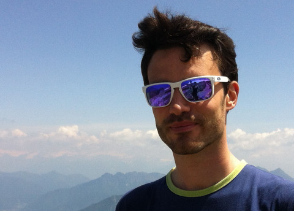

<!-- 
 -->

## Facts in short

- Physicist.
- Scientific Programmer.
- Network neuroscientist.

## Longer story

In my career I've always been involved with computation in many of its applications. I've started with Monte Carlo methods in radiation treatment planning, then moved to machine learning. In the last years I shifted my attention to computational models of brain fMRI activity exploiting the powerful theoretical machinery of complex networks.
This blog collects results, ideas and notebooks of my work. Not all the content of this website is completely finished, so take it as it is.

## Contact me
I'm currently working at the **Center for Neuroscience and Cognitive Systems** of **Istituto Italiano di Tecnologia**, hosted at University of Trento, in the city of **Rovereto, Corso Bettini 31**, Italy.

<!-- 

<a class="google-map-code" href="http://www.map-embed.com" id="get-map-data">embed google map</a>
 -->

<h2>Recently posted</h2>

<ul class="post-list">
    
        <li>
            {{ post.date | date: "%b %-d, %Y" }}
            <h2>
                <a class="post-link" href="{{ post.url | prepend: site.baseurl }}">{{ post.title }}</a>
            </h2>
            {{ post.excerpt }}
        </li>
    
</ul>
