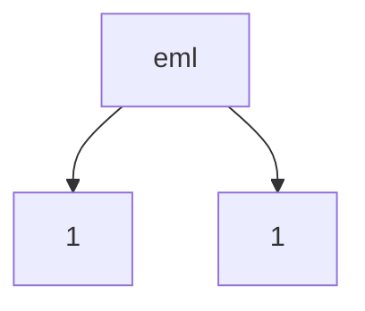
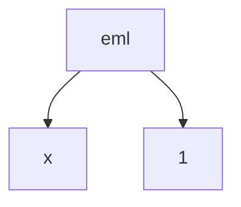
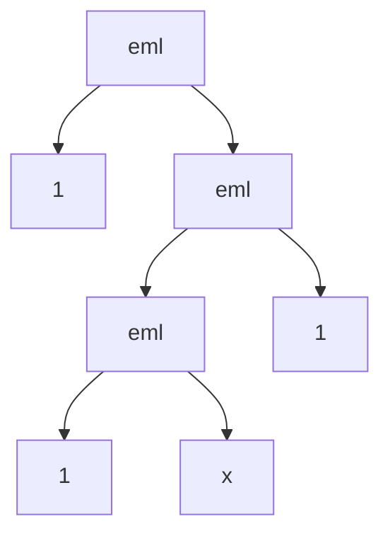
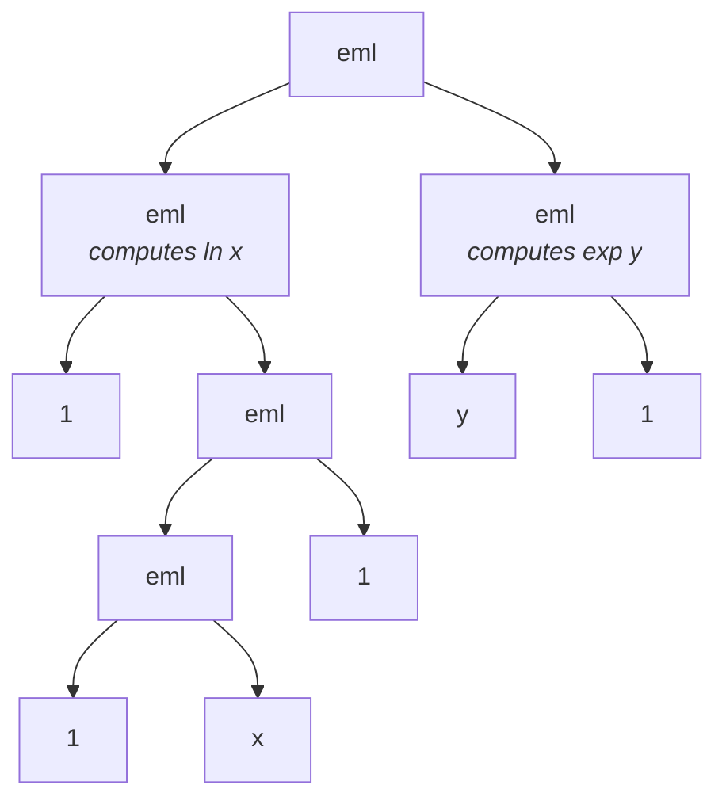

## All elementary functions from a single operator

I just came across a fascinating new paper by Andrzej Odrzywołek titled "All elementary functions from a single operator". The *continuous* version of the [Sheffer stroke](https://en.wikipedia.org/wiki/Sheffer_stroke) is introduced (aka the NAND gate)

[https://arxiv.org/pdf/2603.21852v2](https://arxiv.org/pdf/2603.21852v2)

If you have any background in computer science, you probably know about the NAND gate.
It’s a beautiful concept: you can build absolutely any digital logic circuit, and by extension any computer, using nothing but NAND gates.
It is the universal building block of the discrete, digital world.

But what about continuous mathematics?

Calculators have dozens of buttons: addition, subtraction, multiplication, division, sines, cosines, logarithms, roots, and exponents.
Sure, we know some are related—you can get a tangent by dividing a sine by a cosine—but historically, we've never had a "NAND gate" for calculus and continuous math.
We’ve always needed a handful of different operations to make things work.

Odrzywołek’s paper proves that you only need a calculator with exactly two buttons to compute absolutely everything: the number `1`, and a brand new binary operator he calls `EML`.

## Meet the EML operator

The operator is shockingly simple. It stands for "Exp-Minus-Log", and it looks like this:

$$
\rm{eml}(x, y) = \exp(x) - \ln(y)
$$

If you have this single function, and the constant `1` to feed into it, you can derive the entire standard repertoire of a scientific calculator.
You can build arithmetic, trigonometry, hyperbolic functions, and constants like $e$, $\pi$, and the imaginary unit $i$.

Let's say you just want to compute $e^x$.
How do you do it with our two buttons?
You just plug $x$ and $1$ into the operator:

`eml(x, 1) = exp(x) - ln(1)`

Since the natural log of 1 is 0, this simplifies perfectly to $e^x$.

What if you want the natural log of $x$? This requires nesting the operator. It looks like this:

`ln(x) = eml(1, eml(eml(1, x), 1))`

If you trace the math, the inner terms cancel out the exponentials and leave you with exactly the logarithm.

From here, the paper shows how you can bootstrap everything else.
You can build addition, subtraction, multiplication (which takes an expression nested 8 levels deep!), division, and eventually sines and cosines.

To do this, the author ran a symbolic regression task, starting from a calculator's 36 primitives (variables, constants, unary functions, and binary operations).
He then wrote an algorithm to systematically remove one button at a time, checking if the remaining buttons could still be combined to recreate the missing one.

He managed to shrink the calculator down to 6 buttons, then 4, then 3.
At 3 buttons, the system only needed the exponential function and arbitrary base logarithms.
This strongly hinted that a single binary operator was possible.
After testing various asymmetrical combinations of inverse functions, the EML operator emerged as the winner.

## Why does this actually matter?

If you are a programmer or a machine learning engineer, you should be getting excited right about now.
Up until today, if you wanted an AI to discover a mathematical formula from data (a field called symbolic regression), the AI had to search through a messy, heterogeneous grammar.
It had to randomly try adding things, multiplying things, throwing in a sine wave, or taking a square root. The search space is a nightmare.

> With the EML operator, every single math formula in existence can be represented as a uniform, binary tree of identical nodes!


The grammar becomes trivially simple.
A node is either the number `1`, an input variable `x`, or an `eml()` function containing two child nodes.

Because the structure is so uniform, you can build a "master formula" tree and just use standard gradient descent (like the Adam optimizer you use for neural networks) to train it.
He built EML trees, fed them raw data points, and the neural network successfully snapped the weights into place to discover the exact, closed-form elementary functions that generated the data.

Instead of an AI giving you a massive, uninterpretable matrix of weights, an EML-based network can give you back a clean, exact mathematical formula.

## Visualizing EML trees

Because every EML expression reduces to a strict binary tree, we can visualize the Abstract Syntax Tree (AST) of these functions using Mermaid charts.
Let's look at a few examples:

**1. The constant $e$**
Since $e = \exp(1) - \ln(1) = \text{eml}(1, 1)$, the AST is simply:



**2. The exponential function $e^x$**
Since $e^x = \exp(x) - \ln(1) = \text{eml}(x, 1)$, we just replace the left branch with $x$:



**3. The natural logarithm $\ln(x)$**
This one requires nesting to cancel out the exponentials: $\ln(x) = \text{eml}(1, \text{eml}(\text{eml}(1, x), 1))$



**4. Subtraction $x - y$**
Subtraction is incredibly elegant: $x - y = \exp(\ln(x)) - \ln(\exp(y))$. This means subtraction is exactly `eml(ln(x), exp(y))`! When we expand the inner functions, the full AST looks like this:



## Python code

The fact that `eml(x,y)` generates everything means that an Abstract Syntax Treefor any mathematical formula reduces to a strictly homogenous binary tree.
You can run this script directly to see the forward evaluations and the backward pass over the EML trees.

```python
import numpy as np

# --- 1. The Single Primitive ---
def eml(x, y):
    """The continuous Sheffer stroke: exp(x) - ln(y)"""
    with np.errstate(all="ignore"):
        return np.exp(x) - np.log(y)

# We use complex numbers internally as EML evaluates ln(-1) to build constants
ONE = 1.0 + 0j

# --- 2. Pure EML Composition Library ---
# Every standard operation is built strictly from eml(x, y) and ONE.
E = eml(ONE, ONE)

def EXP(x): return eml(x, ONE)
def LN(x): return eml(ONE, eml(eml(ONE, x), ONE))
def DIV(x, y): return EXP(eml(LN(LN(x)), y))
def INV(x): return DIV(EXP(eml(LN(ONE), x)), E)
def NEG(x): return LN(INV(EXP(x)))
def MUL(x, y): return DIV(x, INV(y))

# Let's test on some random positive inputs
x_val = np.array([2.5, 3.1, 4.2], dtype=complex)
y_val = np.array([1.5, 1.2, 1.8], dtype=complex)
ONES = np.ones_like(x_val)

print("--- Forward Pass Checks ---")
print(f"EXP(x): {EXP(x_val)[0].real:.4f} | True: {np.exp(x_val.real)[0]:.4f}")
print(f"LN(x):  {LN(x_val)[0].real:.4f} | True: {np.log(x_val.real)[0]:.4f}")
print(f"INV(x): {INV(x_val)[0].real:.4f} | True: {1.0/x_val.real[0]:.4f}")
print(f"x * y:  {MUL(x_val, y_val)[0].real:.4f} | True: {(x_val.real * y_val.real)[0]:.4f}")

# --- 3. AST & Backpropagation via Pure EML Autograd ---
class EMLNode:
    """A computational graph node consisting only of eml(x,y) operations."""
    def __init__(self, left, right, name=""):
        self.left = left    # can be EMLNode or complex float/array
        self.right = right  # can be EMLNode or complex float/array
        self.name = name
        self.val = None
        self.grad = 0.0 + 0j     # dL / d(this_node)

    def forward(self):
        val_l = self.left.forward() if isinstance(self.left, EMLNode) else self.left
        val_r = self.right.forward() if isinstance(self.right, EMLNode) else self.right
        self.val = eml(val_l, val_r)
        return self.val

    def backward(self, grad_output=ONE):
        # Accumulate incoming gradients
        self.grad += grad_output
            
        val_l = self.left.val if isinstance(self.left, EMLNode) else self.left
        val_r = self.right.val if isinstance(self.right, EMLNode) else self.right
        
        # PURE EML GRADIENT COMPUTATION
        # Instead of multiplying and dividing, we use our pure EML composition functions!
        
        # df/dl = grad_output * exp(l)
        grad_left = MUL(grad_output, EXP(val_l))
        
        # df/dr = grad_output * (-1 / r)
        grad_right = MUL(grad_output, NEG(INV(val_r)))
        
        # Pass the exact EML-derived gradients downstream
        if isinstance(self.left, EMLNode): self.left.backward(grad_left)
        if isinstance(self.right, EMLNode): self.right.backward(grad_right)
        
        # Storing for final leaf extraction
        self.grad_left = grad_left
        self.grad_right = grad_right

    def get_ast(self):
        l_str = self.left.get_ast() if isinstance(self.left, EMLNode) else str(self.left.real)
        r_str = self.right.get_ast() if isinstance(self.right, EMLNode) else str(self.right.real)
        return f"eml({l_str}, {r_str})"

print("\n--- Backprop & AST Example: f(x) = ln(x) ---")
# Build the AST for ln(x) = eml(1, eml(eml(1, x), 1))
x_input = 2.5 + 0j
ast_ln = EMLNode(ONE, EMLNode(EMLNode(ONE, x_input), ONE))
print("AST for LN(x):", ast_ln.get_ast())

# Forward
val = ast_ln.forward()
print(f"Forward eval at x={x_input.real}: {val.real:.4f} (True: {np.log(x_input.real):.4f})")

# Backward: if f(x) = ln(x), then df/dx = 1/x
ast_ln.backward(grad_output=ONE)

# The node x_input is located at ast_ln.right.left's right parameter.
# The gradient flowing into the right parameter of ast_ln.right.left is grad_right!
grad_x = ast_ln.right.left.grad_right
print(f"Computed df/dx purely using EML: {grad_x.real:.4f} (True: {1.0/x_input.real:.4f})")
```

### Backpropagation: issues

If we compose equations into a pure EML binary tree, the local gradients are profoundly simple and asymmetric:

- Left Branch (exp): The incoming gradient is multiplied by `exp(left)`.
- Right Branch (ln): The incoming gradient is multiplied by `-1 / right`.

This creates a highly unusual backpropagation flow: gradients traveling down the left sides of the tree explode exponentially, while gradients traveling down the right sides of the tree are damped hyperbolically.
If you train these circuits with Adam (as the paper did for symbolic regression), the conditioning of the Hessian requires careful gradient clipping or logarithmic parameterization to keep exp(exp(...)) from completely blowing out of FP64 range.

### Interesting Follow-ups in Hardware (FPGA/ASIC)

The implication for FPGAs is quite wild. If you adopt `eml(x, y)` as your sole primitive:

- The Ultimate Systolic Array: Instead of allocating specific silicon area to ALUs, multipliers, and floating-point logic, an FPGA could consist of a vast sea of identical eml cells. Any equation maps cleanly to this grid. The placement and routing algorithms become trivial: you just map a binary tree onto a 2D mesh of identical tiles.
- Fused EML Cores: To make this viable, the hardware block for eml(x, y) would need to be a deeply optimized, pipelined core. You would build a fused ExpMinusLog FPU. Because you don't need a separate multiplier or adder (they are eventually synthesized from `eml`), you spend your entire silicon budget making this one cell absurdly fast and precise.
- Pipelining Trade-offs: The primary drawback for hardware is depth. While multiplication (x * y) is a 1-cycle operation in a modern DSP slice, in an EML-based system, it takes an AST of depth 8.
- Your pipeline length increases significantly. A critical follow-up research topic would be analyzing whether the massive clock speeds enabled by identical, highly regular cellular architectures offset the latency of the deep tree evaluation.
