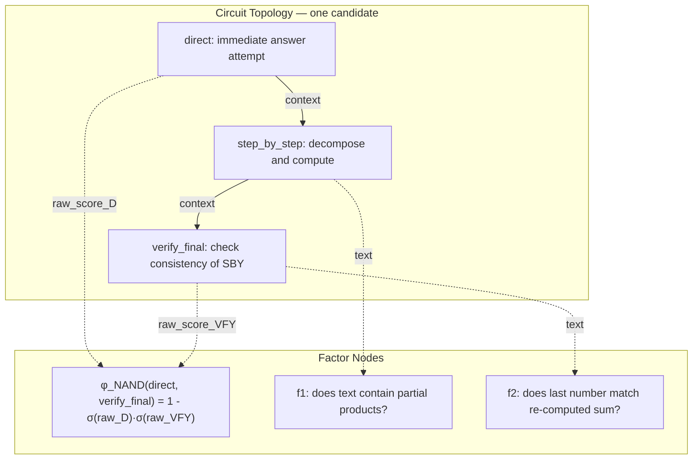
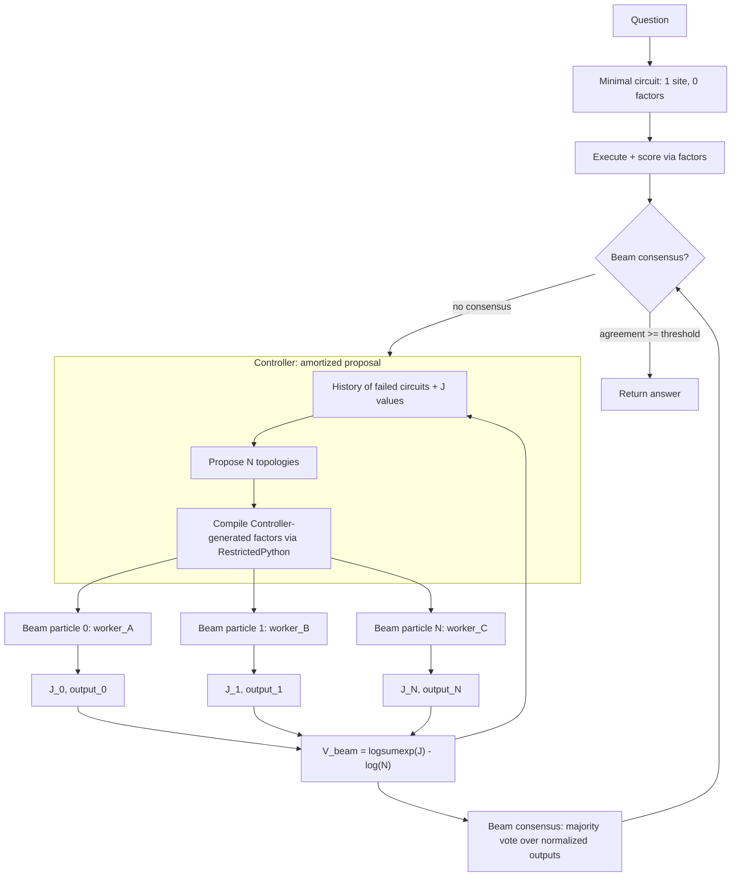
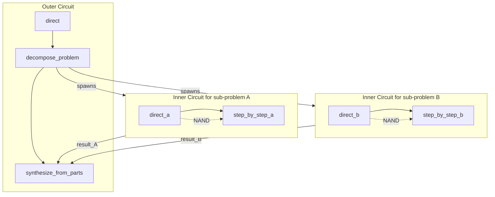

I have been spending a lot of time lately staring at agent logs.

Not the polished demos — the real ones. The ones where a model iterates through ten `THINK:` steps, calls a tool that returns the wrong intermediate result, then confidently announces an answer that is wrong in a way that is completely consistent with everything it just computed. The loop completes. The trace looks busy. The answer is wrong.

The problem is not intelligence. It is architecture.

Standard agent loops — ReAct and its descendants — impose a fixed computational topology: think, act, observe, repeat. The LLM decides *what* to do at each step, but the *shape* of the program is fixed in the scaffolding. There is no formal criterion for whether the program was efficient, minimal, or even correct. The loop terminates when the model says "Final Answer:" — a heuristic.

In this post I want to describe an alternative I have been building, which I call **agentic soft logical circuits**. The idea is to replace the fixed think-act-observe loop with a factor graph whose topology is itself discovered by a Controller LLM, whose nodes are soft NAND gates, and whose objective is a genuine ELBO from variational inference. The Controller does not know the correct answer in advance — it designs internal consistency checks, samples multiple candidate programs in parallel, and uses beam consensus to decide when to stop. This is related to ideas I have been developing in [Probabilistic Language Programming](), [PLP and Energy-Based Models](), and [From hard to soft operators]().

---

## The problem with linear chains

Let me be precise about what a standard ReAct agent is. It is a program of the form:


Every node is the same LLM. The topology is fixed. The only stochasticity is in the content of each node's output, not in the structure of the graph. There is no penalty for redundancy — if two steps compute the same thing, the loop does not know and does not care. There is no energy function measuring whether the program is minimal or correct. Convergence is purely heuristic.

From a probabilistic programming standpoint, this loop corresponds to a very flat proposal distribution over programs: the Controller samples one sequence of thought-action-observation transitions, each conditioned on all previous steps. The distribution over *programs* (topologies) is a point mass. You either sample the right topology from context at the start, or you are stuck with the wrong one for the entire inference.

This is a support problem. As I argued in the [PLP post](), if the correct trace carries almost no mass under the proposal, more sampling just repeats the same blind spot.

---

## Why NAND: universality and the soft competition primitive

Before the variational inference formulation, I want to motivate the choice of NAND as the fundamental factor. The choice is not aesthetic — it is the minimal universal basis for composing arbitrary factor graph potentials, for the same reason that NAND is universal in Boolean algebra.

If you have read [the post on the continuous Sheffer stroke](), you know that any digital circuit can be built from NAND gates alone — it is functionally complete. In the [hard-to-soft operators post](), I showed how every hard Boolean operation has a canonical-ensemble relaxation via a temperature-parameterized functor $F_T : \mathcal{H} \to \mathcal{S}$. The same functor applied to the NAND gate gives us a **soft NAND factor**. Because any Boolean potential over binary variables can be expressed as a NAND circuit, any soft potential over sigmoid-activated scores can be expressed as a composition of soft NAND factors. This is what makes NAND the minimal compositional algebra for our factor graph: we need only one primitive type to express any structural constraint.

A hard NAND gate on two Boolean inputs $a, b \in \{0,1\}$ outputs $1$ except when both inputs are $1$. Applied to *alternative approaches* to the same sub-problem, this encodes exactly the right prior: "at least one of these two should be off" — it is wasteful for both to succeed. If both succeed, you have redundancy.

The soft version replaces binary activations with real-valued scores passed through a sigmoid $\sigma$ (the Boltzmann distribution for site activation, in the thermodynamic language):

$$
\phi_{\rm NAND}(a, b) = 1 - \sigma(a) \cdot \sigma(b)
$$

This is a factor in a factor graph. Its log is:

$$
\log \phi_{\rm NAND}(a, b) = \log\!\left(1 - \sigma(a)\sigma(b)\right)
$$

The table below shows how this behaves:

| $a$ (score site A) | $b$ (score site B) | $\sigma(a)$ | $\sigma(b)$ | $\phi$ | $\log\phi$ |
|---|---|---|---|---|---|
| $-5$ | $-5$ | $0.007$ | $0.007$ | $\approx 1$ | $\approx 0$ |
| $-5$ | $+5$ | $0.007$ | $0.993$ | $\approx 0.99$ | $\approx -0.007$ |
| $+5$ | $+5$ | $0.993$ | $0.993$ | $\approx 0.013$ | $\approx -4.3$ |

When both sites score high — both alternative approaches succeed — the NAND factor applies a heavy penalty ($\log\phi \approx -4.3$). When only one succeeds, the penalty is negligible. This is superoptimization in the thermodynamic sense: the system is penalized for using more computation than necessary to reach the answer.

The [post on hard-to-soft operators]() situates this precisely: the NAND gate is the binary Boolean restriction; $\phi_{\rm NAND}$ is its canonical ensemble relaxation, with the sigmoid playing the role of the Boltzmann distribution for site activation.

NAND gates have been studied in the context of soft logic in several lines of work. The key insight from [probabilistic soft logic](https://linqs.org/projects/psl/) (Bach et al., 2017) is that a Markov Logic Network with continuous relaxations of Boolean connectives induces a valid energy-based model. The continuous NAND corresponds to the Łukasiewicz t-norm complement: $N(a,b) = \max(0, 1-a-b+ab)$ — which in our log-space formulation becomes the soft NAND factor. More recently, [differentiable logic gates for learning](https://arxiv.org/abs/2110.11309) (Petersen et al., 2021) showed that end-to-end gradient flow through logic circuits is possible when gates are soft. My contribution here is using the NAND factor in a *generative* factor graph over LLM-call sites, not in a discriminative classifier.

---

## A factor graph over sample sites

The idea behind **agentic soft logical circuits** is to replace the ReAct chain with an explicit factor graph, where:

- **Nodes** (sample sites) are LLM calls, each with a prompt template
- **Edges** (factors) are soft scoring functions, some generated deterministically, some generated by the Controller LLM
- **NAND edges** connect *alternative* approaches to the same sub-goal, encoding structural parsimony
- The **output site** is the designated node whose output is returned



The **objective** for a circuit execution is:

$$
J = \lambda_f \sum_{i} f_i(\text{site}_i) + \lambda_\phi \sum_{(a,b)} \log\phi_{\rm NAND}(a, b)
$$

where $f_i$ are the log-weight factors and $\phi_{\rm NAND}(a,b)$ are the NAND penalties between competing sites. The raw score of each site is $\text{raw}(s) = \sum_{i: \text{attached\_to}=s} f_i$.

This is exactly the energy function of a factor graph model. J is a valid ELBO when interpreted as a variational bound — which I will make precise in the next section.

---

## Connecting to PLP: the circuit as a structured decomposition of $\Phi(\tau)$

Before deriving the ELBO, I want to ground the circuit in the formal framework from the PLP paper. The foundational equation is the **semantic target**:

$$
p_{\mathcal{D}}(\tau \mid x) \propto \pi_{\mathcal{D}}(\tau \mid x) \, \Phi(\tau, x)
$$

where $\pi_{\mathcal{D}}(\tau \mid x)$ is the proposal law — the distribution over traces induced by running the workflow forward under deployment $\mathcal{D}$ — and $\Phi(\tau, x) \geq 0$ is the potential that encodes what the designer accepts or rewards. The semantic target $p_{\mathcal{D}}$ is the distribution of traces where the raw generations have been reweighted by the verification signal.

In a standard scaffold (best-of-K, ReAct, self-consistency), $\Phi$ is a monolithic function: a test suite passes, a judge says "correct," or a majority vote wins. The scaffold has no way to *decompose* $\Phi$ into parts, so it cannot diagnose which component of the verification failed or how to fix the topology.

The key insight of the circuit optimizer is that it **factorizes** the potential into a product of local factors and structural constraints:

$$
\Phi(\tau, x) = \prod_{i} \exp\bigl(\lambda_f \, f_i(\tau)\bigr) \cdot \prod_{(a,b) \in \mathcal{E}_{\rm NAND}} \phi_{\rm NAND}\bigl(r_a(\tau), r_b(\tau)\bigr)
$$

where $f_i(\tau)$ are the Controller-generated factor log-weights (continuous scores, not binary), $r_s(\tau) = \sum_{i:\text{attached}(i)=s} f_i(\tau)$ is the aggregate score at site $s$, and $\mathcal{E}_{\rm NAND}$ is the set of NAND edges between competing sites.

This decomposition is exactly what makes the inference *structured* rather than monolithic. Each factor $f_i$ is a local verification check — "do the partial products sum correctly?", "is the output format parseable?" — synthesized by the Controller at runtime and compiled via RestrictedPython. The NAND factors encode the structural prior that competing approaches to the same sub-problem should not both be active.

The log of the factored potential gives us the circuit energy:

$$
\log \Phi(\tau, x) = \lambda_f \sum_i f_i(\tau) + \sum_{(a,b) \in \mathcal{E}_{\rm NAND}} \log \phi_{\rm NAND}(r_a, r_b) \;=:\; J(\tau)
$$

This is the $J$ that appears throughout the code and the rest of this post. It is not an arbitrary score — it is the log of the structured potential in the PLP semantic target.

---

## The ELBO formulation: amortized structured variational inference

With the PLP notation in hand, I can now state the variational inference formulation precisely.

David Blei's canonical treatment of variational inference (Blei, Kucukelbir & McAuliffe, 2017, *JASA*) identifies the core problem: given a joint $p(z, x)$, find a tractable approximation $q_\psi(z)$ to the intractable posterior $p(z \mid x)$. Minimizing $\text{KL}(q_\psi \| p(\cdot \mid x))$ is equivalent to maximizing the ELBO:

$$
\mathcal{L}(\psi) = \mathbb{E}_{q_\psi(z)}\!\left[\log p(x \mid z)\right] - \text{KL}\!\left(q_\psi(z) \| p(z)\right)
$$

The **structured** version (Saul & Jordan, 1996; Wainwright & Jordan, 2008) replaces the mean-field factorization with a family that preserves conditional independence structure — a chain, a tree, or a factor graph. The topology of the variational family matters: it determines which correlations between latents are captured.

In the PLP setting, the correspondence is direct. The semantic target $p_{\mathcal{D}}(\tau \mid x)$ plays the role of the posterior — it is the distribution over correct traces, which is intractable. The Controller proposes a circuit topology $\psi$ (sites, NAND edges, factor code), which induces a variational family $q_\psi(\tau \mid x)$ — the set of traces reachable by executing that specific circuit with worker LLMs:

| PLP / Variational Inference | Circuit Optimizer |
|---|---|
| Semantic target $p_{\mathcal{D}}(\tau \mid x)$ | Intractable distribution over "correct reasoning traces" |
| Proposal $\pi_{\mathcal{D}}(\tau \mid x)$ | Forward execution of a circuit with worker LLMs |
| Potential $\Phi(\tau, x)$ | $\prod \exp(\lambda_f f_i) \cdot \prod \phi_{\rm NAND}$: factored into local checks + structural prior |
| Variational parameters $\psi$ | Circuit topology (sites, NAND edges, factor code) |
| ELBO $\mathcal{L}(\psi)$ | Circuit energy $J(\tau) = \log \Phi(\tau, x)$ |

The ELBO decomposes naturally along the factored potential:

$$
J(\tau) = \underbrace{\lambda_f \sum_i f_i(\tau)}_{\text{likelihood: local consistency checks}} + \underbrace{\sum_{(a,b)} \log\phi_{\rm NAND}(r_a, r_b)}_{\text{structural prior: parsimony}}
$$

The **first term** is the log-likelihood contribution: do the outputs at each site survive the Controller's internal consistency checks? These factors are the PLP $\mathsf{factor}$ primitives — they add log-weights to the trace, reweighting the proposal toward traces that pass verification. The **second term** is the structural KL prior: the NAND penalty penalizes circuits that use more sites than necessary, pushing toward the simplest correct program. This is the superoptimization principle, or equivalently, Occam's razor encoded in the factor graph topology.

The importance weights from the PLP paper's self-normalized estimator (Eq. 8 in the paper) apply directly:

$$
\hat{\mu}_h = \frac{\sum_{k=1}^K h(\tau_k) \Phi(\tau_k)}{\sum_{k=1}^K \Phi(\tau_k)} = \frac{\sum_{k=1}^K h(\tau_k) \exp(J_k)}{\sum_{k=1}^K \exp(J_k)}
$$

where each $\tau_k$ is a beam particle — a full circuit execution. The weights $w_k = \exp(J_k)$ are the importance weights, and the normalizer $\sum_k w_k$ does not require evaluating $\pi_{\mathcal{D}}$ because the proposal cancels (exactly the point made in the paper: "the proposal cancels because the target is defined relative to the same forward execution law that produced the samples").

The system is **amortized** because the Controller LLM learns in-context from the history of failed circuits. Rather than re-optimizing from scratch, it uses the history of $(\psi_t, J_t)$ pairs to propose better topologies — the amortized inference idea from Kingma & Welling (VAE, 2014), where the inference network predicts good variational parameters directly from the observation.

The system is **structured** because the variational family is not mean-field (independent sites) but a factor graph with explicit NAND structure encoding competition between alternative approaches. This is precisely the move from mean-field VI to structured VI that Blei identifies as critical for capturing correlations.

---

## The beam search as Sequential Monte Carlo

One iteration of the circuit optimizer proposes not one circuit but $N$ candidate topologies in parallel. This is not just an engineering optimization — it maps directly onto the PLP self-normalized estimator.

Each beam iteration works as follows. The Controller, conditioned on history $\Psi_t = \{(\psi_1, J_1), \ldots, (\psi_{t-1}, J_{t-1})\}$, proposes $N$ circuit topologies. Each topology $\psi_k$ defines a structured proposal $\pi_{\psi_k}(\tau \mid x)$. We execute each circuit with a worker LLM, producing traces $\tau_1, \ldots, \tau_N$, and compute the factored potential $\Phi(\tau_k, x) = \exp(J_k)$ for each.

The importance weights are:

$$
w_k = \Phi(\tau_k, x) = \exp(J_k)
$$

and the self-normalized estimator from the PLP paper applies:

$$
\hat{\mu}_h = \frac{\sum_{k=1}^{N} h(\tau_k) w_k}{\sum_{k=1}^N w_k}
$$

The **beam free energy** is the log of the normalizer estimate:

$$
V_{\rm beam} = \log\!\sum_{k=1}^N e^{J_k} - \log N
$$

This is the log-mean-exp over beam particles. It tracks the quality of the Controller's proposal distribution across iterations:

- If all $N$ circuits fail ($J_k \approx -5$ for all $k$), then $V_{\rm beam} \approx -5$ — a support problem
- If one circuit succeeds ($J_k \approx 0$ for some $k$), then $V_{\rm beam}$ jumps toward $0$
- A monotonically increasing $V_{\rm beam}$ across iterations means the Controller is learning in-context to propose better topologies

The beam weights $w_k / \sum_j w_j$ are the SMC weights for approximating the normalizer $Z_{\mathcal{D}}(x) = \sum_\tau \pi_{\mathcal{D}}(\tau \mid x) \Phi(\tau, x)$ from the PLP paper.



The diversity of worker models across beam particles is essential. When all particles use the same LLM, they are positively correlated — they tend to make the same arithmetic errors on the same sub-expressions. The effective sample size collapses to $K_{\rm eff} = K / (1 + (K-1)\rho)$, as I discussed in [the PLP post](). Using five different cheap models (`gpt-4.1-nano`, `llama-3.1-8b`, `qwen3-8b`, `gemma-3-12b`, and `gpt-4.1-mini`) across beam slots forces different error patterns, making the beam genuinely informative.

---

## The Controller as a recursive architecture

Here is where things get interesting. The Controller is not just a topology proposer — it is itself an LLM call that can be composed with other circuits.

In the current implementation, the Controller proposes a flat circuit: a list of sites and factors. But there is nothing preventing the Controller from proposing circuits whose sites are *themselves* circuit invocations — a recursive structure where each node is a sub-problem solved by a nested beam search.



The recursive structure corresponds to the [recursive decomposition with continuation policy]() from earlier posts. The soft value $V(s) = \log Z(s) = \log \sum_{\tau \succ s} \pi(\tau \mid s) \Phi(\tau)$ is exactly the beam free energy at each recursive level.

The Controller can insert new sample sites and new factor nodes at runtime, via structured output generation:

```json
{
  "sites": [
    {"name": "direct", "prompt_template": "..."},
    {"name": "step_by_step", "prompt_template": "...", "input_sites": ["direct"]}
  ],
  "nand_edges": [{"site_a": "direct", "site_b": "step_by_step"}],
  "factors": [
    {
      "name": "check_partial_products",
      "attached_to": "step_by_step",
      "code": "def score(text, question):\n    # no imports — re, math pre-injected\n    nums = re.findall(r'\\d+', text.replace(',', ''))\n    return 2.5 if len(nums) >= 3 else -2.0",
      "description": "Checks that at least 3 intermediate numbers appear in the step-by-step"
    }
  ],
  "output_site": "step_by_step"
}
```

The factor code is compiled at runtime via [RestrictedPython](https://restrictedpython.readthedocs.io) — a proper AST-level sandbox that prevents access to `os`, `sys`, `subprocess`, and arbitrary imports, while allowing `re`, `math`, `json`, `collections`, `itertools`. This is the "think-tool" pattern from early Claude reasoning systems, applied to the factor graph: the Controller writes verification programs, the Python interpreter executes them, and the results feed back into the energy.

---

## Why this is not a ReAct agent

Let me be explicit about the differences, because they are substantive, not cosmetic.

| Dimension | ReAct Agent | Agentic Soft Logical Circuit |
|---|---|---|
| **Topology** | Fixed (think-act-observe) | Variable, discovered by Controller |
| **Program** | Implicit in context window | Explicit, inspectable, serializable |
| **Scoring** | Heuristic ("Final Answer:") | Formal energy $J$ from factor graph |
| **Parsimony** | None | NAND regularization penalizes redundancy |
| **Parallelism** | Sequential | Beam of $N$ parallel candidate programs |
| **Convergence** | LLM decides | Beam consensus with threshold |
| **Theory** | None | ELBO from structured variational inference |
| **Diversity** | Temperature tweaks | Different model families per beam slot |

The NAND gate is doing something specific here that has no analogue in standard agents. When two alternative sites for the same sub-goal both succeed, the NAND factor $\phi = 1 - \sigma(a)\sigma(b)$ approaches $0$, and $\log\phi$ approaches $-\infty$. The system is penalized not for being wrong, but for being *unnecessarily complex*. This is the Occam's razor built into the energy function — and it is the formal justification for why simpler circuits should be preferred when they are sufficient.

This mirrors the minimum description length (MDL) principle: the optimal program is the shortest one that correctly explains the data. In our setting, "data" is the question and "program" is the circuit. The NAND prior is the code-length penalty.

---

## Results: arithmetic, algebra, and factual questions

I ran the system on four problems with `beam_width=4` and `max_iterations=3`, using five different cheap models in the worker pool and `gpt-4.1-mini` as the Controller. Crucially, the Controller did **not** know the correct answer at any point — all convergence was through beam consensus.

| Problem | Ground Truth | System Answer | Correct | Agreement | $V_{\rm beam}$ |
|---|---|---|---|---|---|
| 837 × 492 | 411804 | **411804** | True | 1.00 | -4.47 |
| 56789 × 12345 | 701060205 | **701060205** | True | 0.75 | -3.03 |
| Solve $3x+7=22$ | 5 | 15 (wrong) | False | 0.75 | +0.97 |
| Capital, 2024 Olympics host | Paris | **paris** | True | 1.00 | +0.95 |

The algebra problem failed interestingly: the consensus answer was `15` (the value of $3x$) rather than $5$ (the value of $x$). The beam particles were unanimously computing the right intermediate step and then stopping there. This is a symptom of the output normalization, not of the circuit architecture — and it illustrates why the **beam consensus criterion** is fundamentally different from an oracle: it is robust to format variation but vulnerable to systematic stops at intermediate steps.

The factual question (capital of the 2024 Olympics host) was interesting for a different reason. The Controller generated factors like `reasoned_answer_contains_final_answer` and `reasoning_step1_country_mentioned` — plausibility checks, not ground-truth checks. The beam converged to `paris` with perfect agreement, correct without any oracle.

For comparison, the ReAct baseline on the same problems with the same worker:

| Problem | ReAct Answer | Correct |
|---|---|---|
| 837 × 492 | 411804 | True |
| 56789 × 12345 | **700776405** | **False** |
| Solve $3x+7=22$ | $x = 5$ | — |
| Capital, 2024 Olympics | paris | True |

ReAct failed on the large multiplication because `gpt-4.1-mini` ran `compute 56789 * 12345` in its eval loop and Python returned the wrong answer (`700776405` instead of `701060205`). The beam system succeeded because the consensus across five different models with different arithmetic biases converged to the correct answer, and the Controller-generated factors penalized outputs that lacked a sufficient number of intermediate partial products.

---

## What comes next

There are several directions I find genuinely exciting from here.

**Integration with PLP's reliability theory.** The PLP paper defines a tree decomposition scaffold (Algorithm 1) that allocates local error budgets $\delta_v$ satisfying $\sum_v \delta_v \leq \Delta$ for a target end-to-end error $\Delta$. Each node $v$ maintains bounds on local solve probability $\underline{p}_v$, judge accuracy $\underline{q}_v$, and dependence $\overline{\rho}_v$. The circuit optimizer's beam search is a natural implementation of this: each beam particle is a trace at a decomposition node, the NAND factors encode the competition between alternative approaches at each node, and the beam consensus criterion corresponds to the sequential testing margin $k_v$ from the paper. The next step is to connect the Controller's iteration count to the local budget $K_v$ from Eq. 17 in the paper, making the search theoretically principled rather than heuristically bounded.

**Factor amortization as a library of verification lemmas.** Right now, the Controller synthesizes new factor code at each iteration. A more sophisticated system would reuse factors that worked well across previous problems — amortizing not just the circuit topology but the verification programs themselves. In PLP terms, this is building a library of reusable potentials $\Phi_i$ that compose into richer targets $\Phi = \prod_i \Phi_i$. This mirrors how a human mathematician builds a library of lemmas.

**Recursive circuits with continuation values.** Each $\mathsf{sample}$ site in the circuit could itself be a sub-circuit, solved by a nested beam search. The continuation value $V(s) = \log Z(s) = \log \sum_{\tau \succ s} \pi(\tau \mid s) \Phi(\tau)$ from the [free energy post]() would compose recursively, with $V_{\rm beam}$ at each level serving as the local estimate of $V(s)$.

**Open-ended tasks where $\Phi$ is not binary.** The current implementation already handles factual questions without a ground-truth oracle. The next frontier is tasks where the potential $\Phi(\tau)$ is genuinely continuous and unknown — open-ended reasoning, creative writing evaluation, code debugging — where the Controller must synthesize factors that estimate plausibility rather than verify correctness. This is the regime where the structured decomposition of $\Phi$ matters most: a monolithic judge would be hopelessly miscalibrated, but a factored set of local consistency checks can accumulate weak evidence into a reliable signal.

---

I started this post saying that the problem with linear agent chains is architecture. Having gone through the full ELBO formulation, I want to be more precise: the problem is that linear chains place a point mass on a single topology when they should be integrating over a posterior distribution on topologies, weighted by their energy. The soft NAND circuit is a step toward making that integration tractable — with beam search as the Monte Carlo estimator, the Controller as the amortized inference network, and the ELBO as the criterion that keeps everything honest.

This is a modest claim, really. The architecture does not make the LLMs smarter. It makes the *search over programs* principled. And a principled search beats a clever heuristic, eventually.

---

## References

- Blei, D.M., Kucukelbir, A., McAuliffe, J.D. (2017). Variational inference: A review for statisticians. *JASA*, 112(518), 859–877.
- Saul, L.K., Jordan, M.I. (1996). Exploiting tractable substructures in intractable networks. *NIPS 8*.
- Wainwright, M.J., Jordan, M.I. (2008). Graphical models, exponential families, and variational inference. *Foundations and Trends in Machine Learning*, 1(1–2).
- Kingma, D.P., Welling, M. (2014). Auto-encoding variational Bayes. *ICLR 2014*.
- Bach, S. et al. (2017). Hinge-loss Markov random fields and probabilistic soft logic. *JMLR*, 18(109).
- Petersen, F. et al. (2021). Differentiable logic machines. *arXiv:2110.11309*.
- Blondel, M. et al. (2025). Autoregressive models as energy-based models. *ICLR 2025*.
- Yao, S. et al. (2023). ReAct: Synergizing reasoning and acting in language models. *ICLR 2023*.


