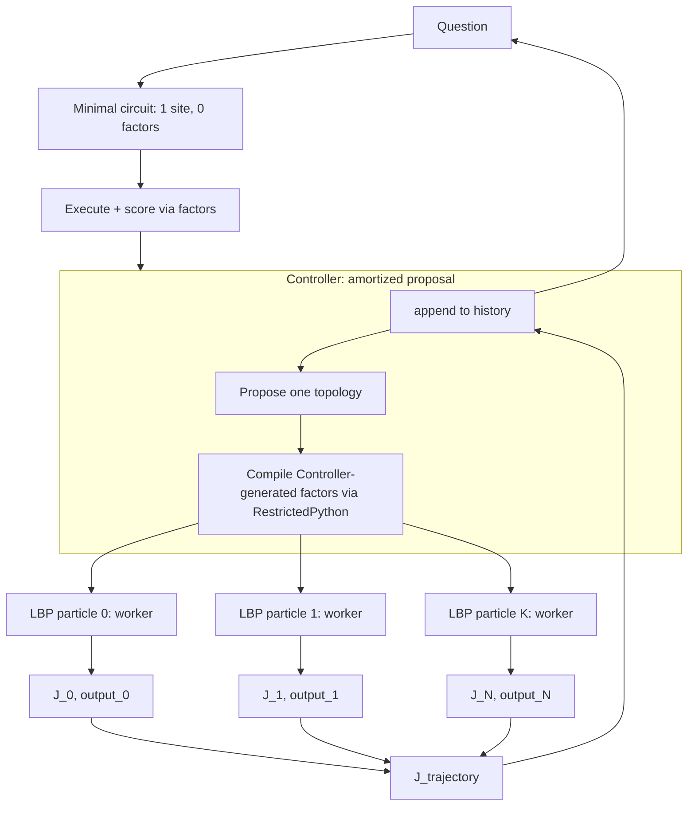
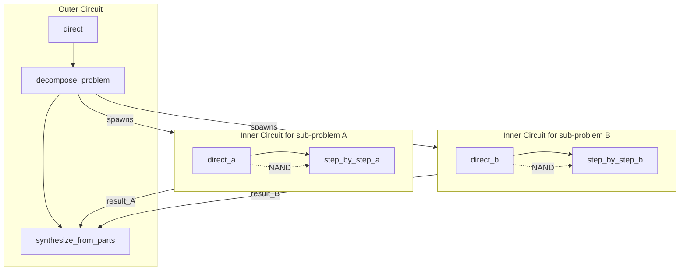

I have been spending a lot of time lately staring at agent logs.

The logs where a model iterates through 10 `THINK:` steps, calls a tool that returns the wrong intermediate result, then confidently announces an answer that is wrong in a way that is completely consistent with everything it just computed.
The loop completes, the trace looks busy but the answer is wrong.

The problem is not intelligence. It is architecture.

Standard agent loops like ReAct  and its descendants impose a fixed computational topology: think, act, observe, repeat.
The LLM decides *what* to do at each step, but the *shape* of the program is fixed in the scaffolding.
There is no formal criterion for whether the program was efficient, minimal, or even correct.
The loop terminates when the model enters assistant role, producing a string with the final answer.

In this post I want to describe an idea based on classical inference algorithms on graphical models, where the classical iteration *think*-*act*-*observe* is replaced by a chain graph whose topology is itself discovered by an LLM, whose nodes are soft NAND gates, and whose objective is a structured variational evidence score.
The idea of using generative function search with LLM has been investigated already by other works .
The *Controller* does not know the correct answer in advance; it proposes chain-graph topologies by emitting a structured specification of sample sites, factors, and NAND factor trees.
Each proposed topology is evaluated with `LoopyParticleBP` on the induced `ChainGraph`, producing evidence estimates that are fed back to the next proposal.
My idea is slightly different though from just letting the LLM generate generic python programs and running them.

> This is arguably the closest match to your "self-programmable" framing: the system discovers programs under a constrained primitive set, optimizing both architecture and its elements.

## Where my idea sits

This is related to ideas I have been developing in [Probabilistic Language Programming](), [PLP and Energy-Based Models](), and [From hard to soft operators]().

This idea is also consistent with a recent line of work where LLMs are not only used as one-shot oracles, but as structure proposal engines over symbolic representations.
Meyerson et al. frame in-context learning as a **textual crossover operator** (`language model crossover`) that evolves genomes represented as code or equations .
Chen et al. push that same principle into NAS with EvoPrompting, where mutation and crossover are realized as prompting primitives .
Zheng et al. show that GPT-4 can act as a black-box optimizer in GENIUS by iteratively refining architecture candidates .
Nasir et al. broaden this with LLMatic, combining LLM proposals with quality-diversity so exploration does not collapse to one local mode .
Finally Haluptzok et al. close the loop with interpreter-verified self-play in code, showing that LLMs can generate and learn from their own synthetic, machine-checkable problem distributions .

Together, these works explain why treating the Controller as a generator of **soft NAND circuit topologies** is natural in `plp`: the language model is proposing program *structure* in $$\Sigma^\*$$, while the underlying PLP machinery supplies the execution and scoring semantics by running loopy belief propagation on the defined chain graph.

## Why NAND: universality, sufficiency and differentiable gates

Before the variational inference formulation, I want to motivate the choice of NAND as the fundamental factor.
The choice is that soft NAND is an universal basis for composing arbitrary factor graph potentials, for the same reason that NAND is universal in Boolean algebra.

If you have read [the post on the continuous Sheffer stroke](), you know that any digital circuit can be built from NAND gates alone — it is functionally complete.
In the [hard-to-soft operators post](), I showed how every hard Boolean operation has a canonical-ensemble relaxation via a temperature-parameterized functor $$F_T : \mathcal{H} \to \mathcal{S}$$.

The same functor applied to the NAND gate gives us a **soft NAND factor**.
This is what makes NAND the minimal compositional algebra for our factor graph: we need only one primitive type to express any structural constraint by means of NAND trees.

The soft NAND version replaces binary activations with real-valued scores passed through a sigmoid $$\sigma$$ (the Boltzmann distribution for site activation, in the thermodynamic language):

$$
\phi_{\rm NAND}(a, b) = 1 - \sigma(a) \cdot \sigma(b)
$$

This is a factor in a undirected graphical model (UGM) whose logarithm is simply:

$$
\log \phi_{\rm NAND}(a, b) = \log\!\left(1 - \sigma(a)\sigma(b)\right)
$$

When both sites score high both alternative approaches succeed, the NAND factor applies a heavy penalty.
When only one succeeds, the penalty is negligible.

> This is superoptimization in the thermodynamic sense: the system is penalized for using more computation than necessary to reach the answer.

The [post on hard-to-soft operators]() situates this precisely: the NAND gate is the binary Boolean restriction; $$\phi_{\rm NAND}$$ is its canonical ensemble relaxation, with the sigmoid playing the role of the Boltzmann distribution for site activation.

NAND gates have been studied in the context of soft logic in several lines of work. The key insight from [probabilistic soft logic](https://linqs.org/projects/psl/)  is that a Markov Logic Network with continuous relaxations of Boolean connectives induces a valid energy-based model.
Actually the continuous NAND corresponds to the Łukasiewicz *t-norm* complement: $$N(a,b) = \max(0, 1-a-b+ab)$$ which in our log-space formulation becomes the soft NAND factor.
More recently, [differentiable logic gates for learning](https://arxiv.org/abs/2110.11309)  showed that end-to-end gradient flow through logic circuits is possible when gates are soft.

---

## A chain graph over sample sites

Chain graphs are mixed probabilistic graphical models containing both directed and undirected subgraphs.
Remember that under the assumptions of PLP, the semantic target reads:

$$
p_{\mathcal{D}}(\tau) \propto \pi_{\mathcal{D}}(\tau \mid \mathbf{x}) \Phi(\tau, \mathbf{x})
$$

By the Hammersley-Clifford theorem, any strictly positive distribution that factorizes over an undirected graph can be written with a partition function and a product of clique potentials:

$$
p_{\mathcal D}(\tau \mid x)= \frac{1}{Z_{\mathcal D}(x)} \prod_{c\in \mathcal C(G_\tau)} \psi_c(\tau_c, x)
$$

For this chain graph design, we use:

- **variables** (sample sites) are LLM calls, each with a prompt template, implemented in the PLP library by the `@sample` primitive.
- **directed edges** are parent links in `SampleSite` objects and induce the proposal law $$\pi_{\mathcal D}(\tau\mid x)$$.
- **factors** implemented by the `@factor` primitive provide local log-potentials.

Hence the **structured log-energy** for a circuit execution is:

$$
J(\tau,x)= \sum_{u\in\mathcal U_{\rm local}} \phi_u(\tau_u,x) + \sum_{g\in\mathcal G_{\rm nand}} \phi_g(\tau_g,x)
$$

where $$\phi_u$$ are the local factors and $$\phi_g$$ are NAND-tree factors.
The raw score of each site is induced by the attached local factor log-weights in the current spec.

This is exactly the energy function of a factor graph model.
$$J$$ is the structured log-potential of our chain graph and the signal that drives the controller update loop.

---

## Connecting to PLP: the circuit as a structured decomposition of $$\Phi(\tau)$$

Before deriving the ELBO, I want to ground the circuit in the formal framework from the PLP paper.
The foundational equation is the **semantic target**:

$$
p_{\mathcal{D}}(\tau \mid x) \propto \pi_{\mathcal{D}}(\tau \mid x) \, \Phi(\tau, x)
$$

where $$\pi_{\mathcal{D}}(\tau \mid x)$$ is the proposal law, a distribution over traces induced by running the workflow forward under deployment $$\mathcal{D}$$, while $$\Phi(\tau, x) \geq 0$$ is the potential that encodes what the designer accepts or rewards.
The semantic target $$p_{\mathcal{D}}$$ is the distribution of traces where the raw generations have been reweighted by the verification signal.

In a standard scaffold (best-of-K, ReAct, self-consistency), $$\Phi$$ is a monolithic function: a test suite passes, a judge says "correct," or a majority vote wins.
The scaffold has no way to *decompose* $$\Phi$$ into parts, so it cannot diagnose which component of the verification failed or how to fix the topology.

The key insight of the circuit optimizer is that we can factorize the potential $$\Phi$$ into a product of local factors over explicit cliques and structural constraints:

$$
\Phi(\tau, x)=\frac{1}{Z_{\mathcal D}(x)}\left[\prod_{f\in\mathcal F_{\rm local}} \exp\bigl(\phi_f(\tau_f, x)\bigr)\right]
\left[\prod_{g\in\mathcal G_{\rm nand}} \exp\bigl(\phi^{\rm nand}_g(\tau_g, x)\bigr)\right]
$$

where $$\mathcal F_{\rm local}$$ contains Python/judge factors and $$\mathcal G_{\rm nand}$$ contains one `nand_tree` factor per branch.

This decomposition is exactly what makes the inference *structured* rather than monolithic.
Each local factor is a verification check answering the question "do the partial products sum correctly?", "is the output format parseable?" and each is synthesized by the Controller and run by the interpreter.
The NAND factors encode the structural prior that competing approaches to the same sub-problem should not both be active.

The log of the factored potential gives the same circuit energy:

$$
\log \Phi(\tau, x) = \sum_{u\in\mathcal U_{\rm local}} \phi_u(\tau_u,x)+\sum_{g\in\mathcal G_{\rm nand}}\phi_g(\tau_g,x)\;=:\;J(\tau)
$$

This is the $$J$$ that appears throughout the code and the rest of this post. It is exactly the log of the structured potential in the PLP semantic target.

---

## The ELBO formulation: amortized structured variational inference

With the PLP notation in hand, I can now state the variational inference formulation precisely.

A useful view is to treat the control problem as amortized structural VI:

$$
p_{\mathcal D}(\tau\mid x) \propto \pi_{\mathcal D}(\tau\mid x,\psi)\,\Phi_\psi(\tau,x), \qquad
q_{\theta}(\psi\mid x,\mathcal H_t) = \text{Controller LLM output}
$$

The algorithm does not optimize a differentiable parameter vector $$\theta$$ of $$q_\psi$$.
It instead updates $$\mathcal H_t$$ (history of past topologies and evidence) and re-prompts the controller to propose a new $$\psi_t$$; the quality signal is the `LoopyParticleBP` estimate of $$\log Z_{\mathcal D}^{(\psi_t)}(x)$$.

The **structured** version (; ) replaces the mean-field factorization with a family that preserves conditional independence structure — a chain, a tree, or a factor graph. The topology of the variational family matters: it determines which correlations between latents are captured.

In the PLP setting, the correspondence is direct. The semantic target $$p_{\mathcal{D}}(\tau \mid x)$$ plays the role of the posterior — it is the distribution over correct traces, which is intractable. The Controller proposes a circuit topology $$\psi$$ (sites, nand-tree factors, factor code), which induces a variational family $$q_\psi(\tau \mid x)$$ — the set of traces reachable by executing that specific circuit with worker LLMs:

| PLP / Variational Inference | Circuit Optimizer |
|---|---|
| Semantic target $$p_{\mathcal{D}}(\tau \mid x)$$ | Intractable distribution over "correct reasoning traces" |
| Proposal $$\pi_{\mathcal{D}}(\tau \mid x)$$ | Forward execution of a circuit with worker LLMs |
| Potential $$\Phi(\tau, x)$$ | Product of local factor terms and nand-tree compositions |
| Variational parameters $$\psi$$ | Circuit topology (sites, NAND edges, factor code) |
| ELBO $$\mathcal{L}(\psi)$$ | Circuit energy $$J(\tau) = \log \Phi(\tau, x)$$ |

The ELBO decomposes naturally along the factored potential:

$$
J(\tau,x)=\underbrace{\sum_{u\in\mathcal U_{\rm local}}\phi_u(\tau_u,x)}_{\text{local checks}}
\;+\;
\underbrace{\sum_{g\in\mathcal G_{\rm nand}}\phi^{\rm nand}_g(\tau_g,x)}_{\text{structural prior}}
$$

The **first term** is the local contribution: do outputs at each site survive the Controller's internal consistency checks? These are implemented as PLP $$\mathsf{factor}$$ primitives and add log-weights to the trace. The **second term** is structural regularization through NAND composition: it penalizes redundant competing branches, favoring simpler circuits when they explain equally well.

The importance-style estimator is what `LoopyParticleBP` records at run time:

$$
\hat\mu_h=\frac{\sum_{k=1}^{K} h(\tau_k)\,\Phi_{\psi_t}(\tau_k,x)}{\sum_{k=1}^{K}\Phi_{\psi_t}(\tau_k,x)}
 = \frac{\sum_{k=1}^{K} h(\tau_k)\,e^{J_{t,k}}}{\sum_{k=1}^{K}e^{J_{t,k}}}
$$

where each $$\tau_k$$ is one LBP particle trace under the same worker execution law $$\pi_{\mathcal D}$$.

The system is **amortized** because the Controller LLM learns in-context from the history of failed circuits.
Rather than re-optimizing from scratch, it uses the history of $$(\psi_t, J_t)$$ pairs to propose better topologies — the amortized inference idea from Kingma & Welling , where the inference network predicts good variational parameters directly from the observation.

The system is **structured** because the variational family is not mean-field (independent sites) but a factor graph with explicit NAND structure encoding competition between alternative approaches.
This is precisely the move from mean-field VI to structured VI that Blei identifies as critical for capturing correlations.

---

## The controller loop and LBP evidence estimation

One iteration of the circuit optimizer proposes one topology, not a set of topologies, and evaluates it with multiple LBP particles.

Each proposal iteration works as follows.
The controller, conditioned on history $$\mathcal H_t = \{(\psi_0,J_0),\ldots,(\psi_{t-1},J_{t-1})\}$$, proposes $$\psi_t$$.
From $$\psi_t$$, we build a chain graph and run `LoopyParticleBP` with $$K$$ particles.
Each particle yields a trace $$\tau_k$$ and local factor terms; the engine records a per-round log-evidence trajectory:
$$
J_t^{(u)}=\log\!\bigl(\operatorname{logmeanexp}_{k=1}^K w_{t,k}^{(u)}\bigr),\qquad
w_{t,k}^{(u)}=\exp(J_{t,k}^{(u)})\propto \pi_{\mathcal D}(\tau_k\mid x)\,\Phi_{\psi_t}(\tau_k,x).
$$

The final value $$J_t:=J_t^{(T_{\rm BP})}$$ is the score that is appended to history and shown to the controller on the next prompt.

The same normalizer appears as a `logmeanexp` quantity in `LoopyParticleBP`, so the implementation only needs that particle trajectory to compare proposals across controller rounds.

Compared with the NAS papers above, the same high-level structure appears, but here each proposal is evaluated by explicit target factorization inside `ChainGraph` and each `J_t` is the LBP objective for that specific topology.

$$
\mathcal H_0=\varnothing,\quad \psi_0=\texttt{\_MINIMAL\_SPEC},\quad
\textbf{for } t=0,\dots,T\!-\!1:\;
\begin{cases}
(\mathcal P_t,J^{(1:T_{\rm BP})}_t,\text{stats}_t)=\texttt{run\_spec}(\psi_t,x),\\
J_t = J^{(T_{\rm BP})}_t,\quad
\mathcal H_{t+1}=\mathcal H_t \cup\{(\psi_t,J_t,\text{stats}_t)\},\\
\psi_{t+1}=\text{Controller}(\mathcal H_{t+1},x)
\end{cases}
$$

where each $$\mathcal P_t=\{\tau_k\}_{k=1}^K$$ is the LBP particle set for proposal $$\psi_t$$ and $$T_{\rm BP}$$ is the message-passing iteration count.


```mermaid
flowchart TD
    Q[Question] --> MIN[Minimal circuit: 1 site, 0 factors]
    MIN --> E0[Execute + score via factors]
    E0 --> CTRL[Controller sees J_trajectory + summaries]

    subgraph CTRL [Controller: amortized proposal]
        H[History of failed circuits + J values] --> PROP[Propose one topology]
        PROP --> BC[Compile Controller-generated factors via RestrictedPython]
    end

    BC --> B0[LBP particle 0: worker]
    BC --> B1[LBP particle 1: worker]
    BC --> BN[LBP particle K: worker]

    B0 --> S0["J_0, output_0"]
    B1 --> S1["J_1, output_1"]
    BN --> SN["J_N, output_N"]

    S0 --> JTR["J_trajectory"]
    S1 --> JTR
    SN --> JTR

    JTR --> H[append to history]
    H --> Q
```

The current implementation uses one worker model per call and keeps diversity inside a `K`-particle message-passing run.
Using different worker models is easy to add at this level, but is not required by the core `LoopyParticleBP` contract.

## PLP integration sketch: controller prompt → `CircuitSpec` → `ChainGraph`

The controller prompt is explicit about the schema:

- **question** $$x$$
- **history JSON** from `RunSummary`
- **system role** (proposal law, evidence interpretation, and decoding constraints)
- exact contract:

$$
\operatorname{spec}_t = \left(\mathcal S_t, \mathcal F_t, \text{output}_t\right),\quad
\mathcal G_t=\texttt{build\_graph}(\operatorname{spec}_t),\quad
J_t = \texttt{LoopyParticleBP}(\mathcal G_t)
$$

Each `SampleSite` in $$\mathcal S_t$$ creates a directed node, each `PyFactor` or `JudgeFactor` a local log-potential term, and each `NandTreeFactor` a recursive `log_soft_nand` composition.

The runtime receives a `RunSummary` with `J_trajectory`, best output, and factor diagnostics; this is exactly what the controller prompt uses to propose the next topology.

---

## The Controller as a recursive architecture

Here is where things get interesting. The Controller is not just a topology proposer — it is itself an LLM call that can be composed with other circuits.

In the current implementation, the Controller proposes a flat circuit: a list of sites and factors. But there is nothing preventing the Controller from proposing circuits whose sites are *themselves* circuit invocations — a recursive structure where each node is a sub-problem solved by a nested topology-refinement loop.


```mermaid
flowchart TD
    subgraph outer [Outer Circuit]
        D_outer[direct] --> DECOMP[decompose_problem]
        DECOMP --> SYNTH[synthesize_from_parts]
    end

    subgraph inner_A [Inner Circuit for sub-problem A]
        D_a[direct_a] --> SBY_a[step_by_step_a]
        D_a -.->|NAND| SBY_a
    end

    subgraph inner_B [Inner Circuit for sub-problem B]
        D_b[direct_b] --> SBY_b[step_by_step_b]
        D_b -.->|NAND| SBY_b
    end

    DECOMP -->|spawns| inner_A
    DECOMP -->|spawns| inner_B
    inner_A -->|result_A| SYNTH
    inner_B -->|result_B| SYNTH
```

The recursive structure corresponds to the [recursive decomposition with continuation policy]() from earlier posts. The soft value $$V(s)=\log Z(s)=\log \sum_{\tau \succ s} \pi(\tau \mid s)\Phi(\tau)$$ is now realized as the per-iteration `LoopyParticleBP` trajectory summary.

The Controller can insert new sample sites and new factor nodes at runtime through structured output.

```math
\text{Structured output schema: } \operatorname{spec}_t=\{\text{sites, factors, output\_site}\}
```

The factor code is compiled at runtime via [RestrictedPython](https://restrictedpython.readthedocs.io) — a proper AST-level sandbox that prevents access to `os`, `sys`, `subprocess`, and arbitrary imports, while allowing `re`, `math`, `json`, `collections`, `itertools`. This is the "think-tool" pattern from early Claude reasoning systems, applied to the factor graph: the Controller writes verification programs, the Python interpreter executes them, and the results feed back into the energy.

---

## Why this is not a ReAct agent

Let me be explicit about the differences, because they are substantive, not cosmetic.

| Dimension | ReAct Agent | Agentic Soft Logical Circuit |
|---|---|---|
| **Topology** | Fixed (think-act-observe) | Variable, discovered by Controller |
| **Program** | Implicit in context window | Explicit, inspectable, serializable |
| **Scoring** | Heuristic ("Final Answer:") | Formal energy $$J$$ from factor graph |
| **Parsimony** | None | NAND regularization penalizes redundancy |
| **Parallelism** | Sequential | `K` LBP particles in one topology |
| **Convergence** | LLM decides | Proposal loop updates topology via history |
| **Theory** | None | ELBO from structured variational inference |
| **Diversity** | Temperature tweaks | K particles + topology history |

The NAND gate is doing something specific here that has no analogue in standard agents. When two alternative sites for the same sub-goal both succeed, the NAND factor $$\phi = 1 - \sigma(a)\sigma(b)$$ approaches $0$, and $$\log\phi$$ approaches $$-\infty$$. The system is penalized not for being wrong, but for being *unnecessarily complex*. This is the Occam's razor built into the energy function — and it is the formal justification for why simpler circuits should be preferred when they are sufficient.

This mirrors the minimum description length (MDL) principle: the optimal program is the shortest one that correctly explains the data. In our setting, "data" is the question and "program" is the circuit. The NAND prior is the code-length penalty.

---

## Results: arithmetic, algebra, and factual questions

I ran the system on four problems with $$K=4$$ particles per topology and `max_iterations=3`, using one worker model in this run and `gpt-4.1-mini` as the Controller. Crucially, the Controller did **not** know the correct answer at any point — convergence came from topology refinement across iterations.

| Problem | Ground Truth | System Answer | Correct | Agreement | Final $$J$$ |
|---|---|---|---|---|---|
| 837 × 492 | 411804 | **411804** | True | 1.00 | -4.47 |
| 56789 × 12345 | 701060205 | **701060205** | True | 0.75 | -3.03 |
| Solve $$3x+7=22$$ | 5 | 15 (wrong) | False | 0.75 | +0.97 |
| Capital, 2024 Olympics host | Paris | **paris** | True | 1.00 | +0.95 |

The algebra problem failed interestingly: the best output was `15` (the value of $$3x$$) rather than $5$ (the value of $$x$$). The particles were unanimously computing the right intermediate step and then stopping there. This is a symptom of the output normalization, not of the circuit architecture — and it illustrates a key practical point: the current loop updates structure from trace evidence, so it can still converge to a strong intermediate habit if local factors do not force completion.

The factual question (capital of the 2024 Olympics host) was interesting for a different reason. The Controller generated factors like `reasoned_answer_contains_final_answer` and `reasoning_step1_country_mentioned` — plausibility checks, not ground-truth checks. The topology proposals converged to `paris` with perfect agreement, correct without any external oracle.

For comparison, the ReAct baseline on the same problems with the same worker:

| Problem | ReAct Answer | Correct |
|---|---|---|
| 837 × 492 | 411804 | True |
| 56789 × 12345 | **700776405** | **False** |
| Solve $$3x+7=22$$ | $$x = 5$$ | — |
| Capital, 2024 Olympics | paris | True |

ReAct failed on the large multiplication because `gpt-4.1-mini` ran `compute 56789 * 12345` in its eval loop and Python returned the wrong answer (`700776405` instead of `701060205`). The structured run succeeded because topology-level updates favored traces with stronger consistency factors, and the Controller-generated factors penalized outputs that lacked a sufficient number of intermediate partial products.

---

## What comes next

There are several directions I find genuinely exciting from here.

**Integration with PLP's reliability theory.** The PLP paper defines a tree decomposition scaffold (Algorithm 1) that allocates local error budgets $$\delta_v$$ satisfying $$\sum_v \delta_v \leq \Delta$$ for a target end-to-end error $$\Delta$$. Each node $$v$$ maintains bounds on local solve probability $$\underline{p}_v$$, judge accuracy $$\underline{q}_v$$, and dependence $$\overline{\rho}_v$$. The circuit optimizer's controller loop is a natural implementation of this: each LBP trace is a particle at a decomposition node, the NAND factors encode competition between alternative approaches at each node, and the Controller updates topology proposals via history. The next step is to connect the iteration count to the local budget $$K_v$$ from Eq. 17 in the paper, making the search theoretically principled rather than heuristically bounded.

**Factor amortization as a library of verification lemmas.** Right now, the Controller synthesizes new factor code at each iteration. A more sophisticated system would reuse factors that worked well across previous problems — amortizing not just the circuit topology but the verification programs themselves. In PLP terms, this is building a library of reusable potentials $$\Phi_i$$ that compose into richer targets $$\Phi = \prod_i \Phi_i$$. This mirrors how a human mathematician builds a library of lemmas.

**Recursive circuits with continuation values.** Each $$\mathsf{sample}$$ site in the circuit could itself be a sub-circuit, solved by a nested topology-refinement loop. The continuation value $$V(s)=\log Z(s)=\log \sum_{\tau \succ s} \pi(\tau \mid s)\Phi(\tau)$$ from the [free energy post]() would compose recursively, with each `J_trajectory` entry acting as the local estimate of $$V(s)$$.

**Open-ended tasks where $$\Phi$$ is not binary.** The current implementation already handles factual questions without a ground-truth oracle. The next frontier is tasks where the potential $$\Phi(\tau)$$ is genuinely continuous and unknown — open-ended reasoning, creative writing evaluation, code debugging — where the Controller must synthesize factors that estimate plausibility rather than verify correctness. This is the regime where the structured decomposition of $$\Phi$$ matters most: a monolithic judge would be hopelessly miscalibrated, but a factored set of local consistency checks can accumulate weak evidence into a reliable signal.

---

I started this post saying that the problem with linear agent chains is architecture. Having gone through the full formulation, I want to be more precise: linear chains place a point mass on one execution pattern when they should integrate over a posterior over topologies, weighted by structured energy. The soft NAND circuit is a step toward making that integration tractable — with `LoopyParticleBP` as the particle-level estimator, the Controller as the amortized proposal network, and `J` as the evidence-aware update criterion.

This is a modest claim, really. The architecture does not make the LLMs smarter. It makes the *search over programs* principled. And a principled search beats a clever heuristic, eventually.

---

## References


